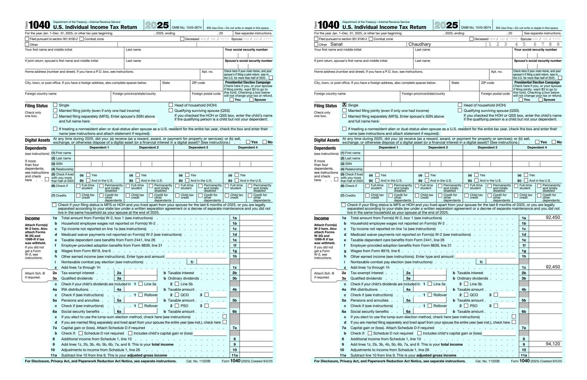

# TaxAnn — Tax Form Annotation System

A data format for annotating U.S. tax forms so any renderer can print a
taxpayer's values into the right boxes. Built for the Instead technical
assessment.

**Read [`SPEC.md`](SPEC.md) for the specification** and
[`DECISIONS.md`](DECISIONS.md) for the design rationale.

## What's here

```
spec/annotation.schema.json        Formal JSON Schema (draft-07) — the spec, machine-checkable
annotations/f1040_2025_slice.json  Annotation set: a real slice of Form 1040 (2025)
data/sample_taxpayer.json          Example taxpayer #1 (single filer)
data/sample_taxpayer2.json         Example taxpayer #2 (MFJ, long names, negative total)
renderer/render.py                 ~250-line reference renderer (overlay-based)
tools/validate.py                  Validates an annotation set against the schema
forms/f1040_2025.pdf               Blank source form (official IRS fillable PDF)
SPEC.md, DECISIONS.md              Documentation
```

## Core idea

An annotation set describes a form **once** and holds **zero taxpayer data**.
Each field answers three questions — **where** the box is, **which** value fills
it, and **how** it should look — and the renderer stamps one taxpayer's data
onto the blank PDF. The annotation never computes anything; it only references
values a tax engine already produced.

## Run it

```bash
python -m venv .venv
source .venv/bin/activate      # Windows: .venv\Scripts\activate
pip install -r requirements.txt

# Render taxpayer 1
python renderer/render.py \
  annotations/f1040_2025_slice.json \
  data/sample_taxpayer.json \
  forms/f1040_2025.pdf \
  out_filled.pdf

# Same annotation, different taxpayer — demonstrates reuse
python renderer/render.py \
  annotations/f1040_2025_slice.json \
  data/sample_taxpayer2.json \
  forms/f1040_2025.pdf \
  out_filled2.pdf
```

## Validate an annotation set against the spec

```bash
python tools/validate.py annotations/f1040_2025_slice.json
```

```
VALID  f1040_2025_slice.json
       7 fields, 1 page(s), spec=taxann/1.0
```

The schema *is* the spec — change a field's `"type"` to `"banana"` and it is rejected.
In VS Code the check is live: `.vscode/settings.json` binds the schema to
`annotations/*.json`, so an invalid annotation is flagged as you type.

## What the slice demonstrates

- **text** — first/last name
- **comb** — SSN distributed across 9 cells with group gaps (`123-45-6789`)
- **choiceGroup** — filing status; the value selects exactly one box
- **currency** — line 1a (raw input) and lines 1z/9 (computed totals), both
  referenced identically; whole-dollar rounding, thousands separators,
  negatives as `(1,234)`
- **overflow** — long names shrink to fit
- **reuse** — one annotation set renders two different taxpayers correctly

## Verification

Correctness is confirmed by **round-trip, not inspection**: known data goes through
the renderer and the output is checked against the real form. `123-45-6789` landing
across the SSN cells and `92,451` sitting in line 1a *is* the proof the mapping is
right.


